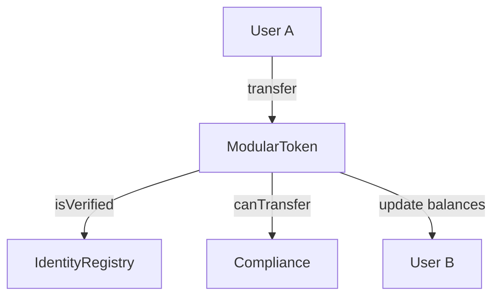

# Tokenization Contracts

A modular framework for asset tokenization on Ethereum, built with Foundry. This project provides a robust foundation for creating compliant digital assets by decoupling token logic, identity verification, and compliance rules.

## Overview

The system is designed with modularity at its core, allowing issuers to easily plug in different identity registries or compliance modules without modifying the core token contract.

### Core Components

- **ModularToken (`src/ModularToken.sol`)**: The central asset contract. It enforces identity and compliance checks on every `mint` and `transfer` operation.
- **IdentityRegistry (`src/IdentityRegistry.sol`)**: A simple registry that tracks verified users. Only verified users can hold or transfer tokens.
- **Compliance (`src/Compliance.sol`)**: A module that defines transfer rules. In its current implementation, it enforces a maximum transfer amount per transaction.

## Getting Started

### Prerequisites

You will need [Foundry](https://book.getfoundry.sh/getting-started/installation) installed on your machine.

### Installation

Clone the repository and install dependencies:

```bash
git clone <repository-url>
cd tokenization-contracts
forge install
```

## Usage

### Build

Compile the smart contracts:

```bash
forge build
```

### Test

Run the test suite:

```bash
forge test
```

For verbose output:

```bash
forge test -vv
```

### Deploy

To deploy the contracts to a local node (Anvil):

1. Start Anvil:
   ```bash
   anvil
   ```

2. Run the deployment script:
   ```bash
   forge script script/Deploy.s.sol --rpc-url http://127.0.0.1:8545 --broadcast
   ```

## Architecture



## License

This project is licensed under the MIT License.
